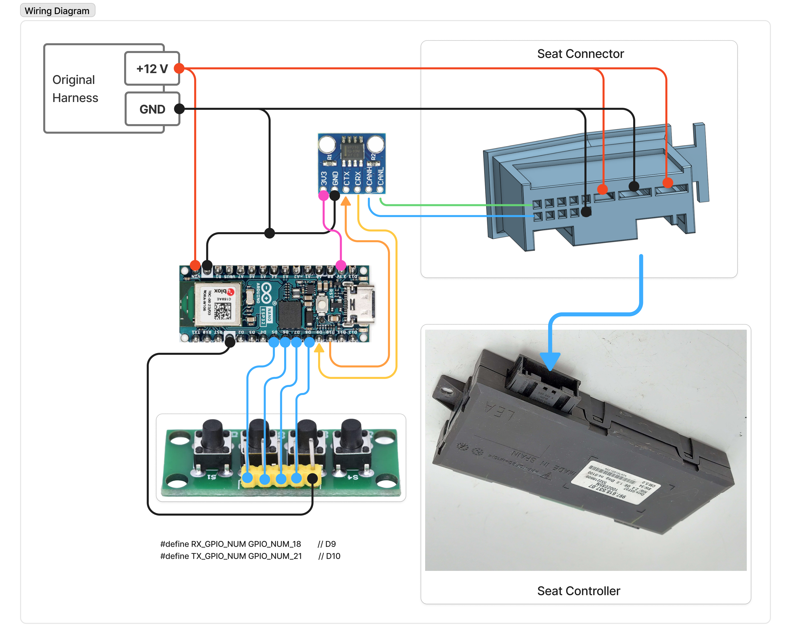

# Adding Buttons to the CAN Harness
If we ever get store and recall working, we'll need buttons. The 3D model for the housing already includes provisions for adding buttons.  Here is the schematic for adding buttons.  But at this point, it's likely not worth the effort so it's not in the main build instructions.

Note that this layouts are prelimnary and not yet refined! Build at your own risk.

