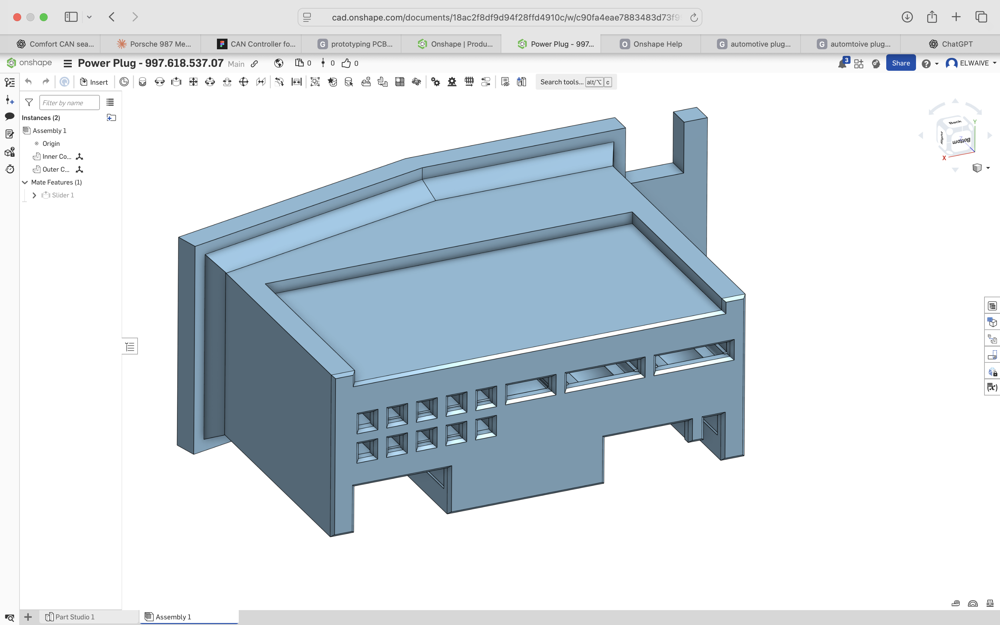

# Goal: Replace 986/996 Seats with 997/987 Seats

**TL;DR**: Installing 997/987 comfort seats in a 986/996 is absolutely worth it! They fit perfectly, are much more comfortable, and the re-wiring is straightforward.  

(You will need to cut some wires, install connectors, and build a special harness for the driver’s side—but nothing too exotic. If you leave a few inches of slack when cutting, the process is reversible.)

  
**Figure 1.** Custom CAN harness for seat power and CAN messages (for the 997/987 driver’s seat).

Here’s what it looks like when finished:  
  
**Figure 2.** 987 comfort seats installed in a 986

---

## Problem Statement
- The original 986 seats are torn and need to be replaced or repaired.

### Should I Consider 997/987 Comfort Seats? — **YES!**

#### Advantages
- 997/987 seats bolt in with no modification (mounting holes align perfectly).  
- Seat belt latch transfers seamlessly.  
- Available in the same colors as 986/996 seats.  
- More comfortable, with additional adjustments (including lumbar support).  
- Driver’s seat sits lower in its lowest setting, offering better ergonomics for taller drivers (I’m 6’1”).  

#### Challenges (and Solutions Below!)
- Different connectors require re-wiring.  
  - Passenger seat: just power + ground.  
  - Driver memory seat: requires CAN commands for manual controls (solution provided below).  

---

> ⚠️ **Disclaimer**  
> This information is provided for educational purposes only.  
> The author assumes no responsibility for any damage, injury, or issues arising from following these instructions.  

> ⚠️ **Important Safety Note**  
> Porsche 997 and 987 seats are equipped with airbags. Working near airbags can be dangerous. While airbags are not used in this project, exercise extreme caution.  
> Always **disconnect the battery** and wait several minutes before starting any work involving seat removal, wiring, or components near airbags.  

---

## Solution (Quick Overview)

### Passenger Side
1. **Disconnect the Battery**  
   - Move the seat to the middle of its travel so all 4 screws are accessible.  
   - Disconnect the battery.  

2. **Remove Original Seat (986/996)**  
   - Remove the seat using a female Torx socket.  
   - The existing black connector (car side and seat side) is reused for the seatbelt buckle sensor (and heated seats if equipped so don't damage it). 
   - Red and Brown (+12V and Ground) wires for seat control are removed from the black connector and wired to a 2-pin automotive connector (female).
   - Remove the seat belt latch with all wires attached. (you can dissassemble the black connector if needed but take pictures and pay close attention so you can put it back together)

3. **Install New Seat (987/997)**  
   - Remove power wires (+12V and Ground) from the yellow connector and install a 2-pin automotive connector (male).  
   - Transfer the seatbelt buckle from the old seat to the new seat. 
   - Connect the 2-pin power connectors (male/female).  
   - Connect the black seat connector between car and seatbelt buckle sensor.  
   - *Do not install mounting screws until testing.*  

4. **Reconnect the Battery**  
   - Reconnect the battery and test seat functions.  
   - Once confirmed, bolt the seat to torque spec using a female Torx socket.  

---

### Driver Side
5. **Fabricate the Custom CAN Control Module**  
   - Build the module (3D print connector and housing, assemble electronics, solder wires).  
   - Install automotive 2-pin power connectors (male).  

6. **Disconnect the Battery**  
   - Move the seat to the middle of its travel so all 4 screws are accessible.  
   - Disconnect the battery.  

7. **Remove Original Seat (986/996)**  
   - Remove the seat using a female Torx socket.  
   - The existing black connector (car side and seat side) is reused for the seatbelt buckle sensor (and heated seats if equipped so don't damage it).  
   - Red and Brown (+12V and Ground) wires for seat control are removed from the black connector and wired to a 2-pin automotive connector (female).
   - Remove the seat belt latch with all wires attached. (you can dissassemble the black connector if needed but take pictures and pay close attention so you can put it back together)

8. **Install New Seat (987/997)**  
     - Transfer the seatbelt buckle from the old seat to the new seat.
   - Install the **Custom CAN Control Module** into the Seat Control Module on the new seat.  
   - Connect the 2-pin power connectors (male/female).  
   - Connect the black seat connector between car and seatbelt buckle sensor.  
   - *Do not install mounting screws until testing.*  

9. **Reconnect the Battery**  
   - Reconnect the battery and test seat functions.  
   - Once confirmed, bolt the seat to torque spec using a female Torx socket.  

---

## Passenger Wiring Procedure (986 → 987 Seat)

*Note: I originally planned to use OEM connectors sourced from eBay but abandoned that approach in favor of generic automotive connectors from Amazon.*  

### Required Supplies
- Automotive connectors:  
  [Amazon: Automotive Male/Female 1–6 Pin Connectors](https://a.co/d/fzqcGEF)  
    
  *Includes crimp tool — critical for secure connections.*  
- Wire cutters  
- Wire strippers  

### 986/996 Seat Connector (Passenger)
![image1]  
Passenger Seat  

![image2]  
Driver Seat  

#### Wiring Details
- **Round Pins**:  
  - A1 (Red): +12V  
  - A6 (Brown): Ground  
  - Gray Pin: Alignment only  
- **Square Black Connector (B1–B4)**: Heated seat control lines  
- **Blue/Green Wires**: Seatbelt latch sensor  
- Heated seat pins (A3, A4) occupy unused round pin locations (not shown).  

*Note: 986/996 seats do not contain airbags.*  

![986_passenger_seat_wiring]  
Connector label: **X16 (Modular Plug Three-Part)**  
- A1: Red (+12V)  
- A4: Brown (Ground)  

#### Work to be Done
- Identify the Red (+12V) and Brown (Ground) wires powering seat controls.  
- Cut a few inches back from the connector (car side).  
- Install an automotive connector on the car/supply side. Use **socket connections** here.  
- By convention:  
  - Supply side = Socket  
  - Load side = Spade  
  - Pin 1 = Ground  
  - Pin 2 = +12V  

### 997/987 Passenger Seat (Non-Memory)
- The yellow connector also contains +12V and Ground.  
- Cut the wires a few inches back, attach a spade-side automotive connector.  
- Ensure Pin 1 = Ground, Pin 2 = +12V.  

![yellow_connector]  

### Testing
At this stage, wiring should be complete.  
- Install the seat and connect all plugs.  
- Double-check polarity.  
- Reconnect the battery.  
- The seat should move via the manual controls.  

---

## Driver Re-wiring Procedure (986 → 987 Seat)
Follow the same steps as the passenger seat.  

- Goal: bring both +12V and Ground into a 2-pin automotive connector.  
- Convention:  
  - Supply side = Socket  
  - Pin 1 = Ground  
  - Pin 2 = +12V  

---

## 997/987 Comfort Memory Driver Seat

> Always disconnect the battery before working.  

### Seat Controller
Memory seats use a **Seating Position Control Unit (997.618.537.07)** rather than direct wiring for movement.  

![997-seat-controller-top]  

- Located under the seat (front right side, near driver’s right heel).  
- Marked with a red box in the photo.  

  

---

## Install the Custom CAN Harness
- Place the 987 seat in position.  
- Plug the custom harness into the Seat Position Control Unit.  
- Connect power to vehicle supply.  

  

- Reconnect the battery and test.  
- Once confirmed, tuck the harness and control box neatly under the seat.  

  

---

## Future Work: Reducing Power Consumption
This setup works but may cause excess current drain because the microcontroller is always leaving the seats in an active state.
### Possible Solution 
- Power only the MCU from Terminal 15 (key-on).  
- The current harness includes a connector on the MCU supply line for this purpose to simplify rerouting later.

---

## Custom CAN Harness

### Overview
![can_playback_harness]  
This is the wiring diagram for the harness.  

> Positioning the MCU and routing wires correctly is critical for fitting the housing.  

### Required Components

1. **Microcontroller: Arduino Nano ESP32**  
   - Natively supports 12V input (no power conversion needed).  
   - Built-in CAN PHY.  
   - [Amazon: Arduino Nano ESP32](https://a.co/d/c2KiPnX)  

2. **CAN Transceiver: TI SN65HVD230**  
   - Converts MCU TX/RX to CAN differential pair.  
   - Remove the onboard 121Ω resistor between CAN H/L.  
   - [Amazon: SN65HVD230 Module](https://www.amazon.com/dp/B0DXDR1ZJ6)  
   ![can_remove_resistor]  

3. **Prototyping PCB (3×7 cm)**  
   - Provides stability for boards and wires.  
   - Placement is important for fitting the housing.  

### Assembly Notes
- Solid-core wire for internal connections.  
- Stranded wire for harness.  
- Use heat-shrink tubing to cover wire solder joints
- Use cloth wire harness tape to keep the wires bundled and prevent rubbing on sharp edges

**Fully built microcontroller and CAN transceiver assembly.**

### 3D-Printed Components
1. **Connector for Power + CAN Bus**  
   - [Onshape Model](https://cad.onshape.com/documents/18ac2f8df9d94f28ffd4910c/v/b826c9e33748ff96d2461c4e/e/8e5a6ba53ed4dd82f9dfe8df)  
   - Requires spade and socket connectors (Amazon links in original).  

     
     
    

   The connector prints in two pieces. The inner is populated with connectors and wires. Then it is inserted into the outer shell and a zip tie is used for strain relief using the tab. 

   

   It seems to print best with a very fine pitch (0.07mm layer height) no supports and 100% infill with PLA. The are a few sacrifical overhangs but overall it seems to print quite well.

   ![][image26]
   
   When populating the inner connector, crimp the connector onto the wire and then insert it wire ends first from the bottom.  Then press the female connectors into the holes. This is the hardest part of the entire build so take your time and re-do the connection of you bend the metal out of shape.

   ![997-seat-controller-connector]
   For reference, this is what you're trying to mate to on the seat controller side. I used an ohm meter (with the beep turned on) to verify all of my connections after my build.
   

2. **Housing for Microcontroller Assembly**  
   - [Onshape Model](https://cad.onshape.com/documents/268283a56fb8a134be7d36af/w/bfc1ac9037cfbc9ba9fc919f/e/98e617924d5669c3e7fdf2b4?renderMode=0&uiState=68b4f8f9239766f221fba383)  
   - Designed as a 2-piece clamp with zip-tie strain relief.  

     
     

---

## Loading the Arduino Sketch
This short program sends the required commands continuously when powered and recovers from live CAN connect/disconnect.  

- WiFi/Bluetooth disabled to save power.  
- [Download the Arduino Sketch](<Code/Arduino Code/seat_manual_control>)  

![aruduino_ide_manual_control]  

**Setup Steps:**
1. Install Arduino IDE (latest) from [arduino.cc](https://www.arduino.cc/en/software).  
2. Add ESP32 board support (Espressif + Arduino packages).  
3. Select **Arduino Nano ESP32** in Tools → Board.  
4. Compile & upload via USB-C cable.  

---

  
**Completed Harness with Cover Removed**

---

## Additional Resources
- [996 / 986 Seat Resources](996-986_seat_resources.md)  
- [997 / 987 Seat Resources](997-987_seat_resources.md)  

## Hacking the 997 / 987 Seat Controller
We used record and playback of CAN signals to get this far but still have a dream of being able to both store and recall seat memory form this setup. The following links provide resources related to that exploration.

- [Link to RAW CAN Recordings](Reference/Recordings)
- [Converting Recordings to SavvyCan Log Files](Code/convert_recordings/log_file_to_savvycan)
- [Playback of SavvyCan files using Arduino](Code/Raspi-CANHat)

## Adding Buttons to the Harness
If we ever get store and recall working, we'll need buttons. The 3D model for the housing already includes provisions for adding buttons.  Here is the schematic for adding buttons.  But at this point, it's likely not worth the effort so it's not in the main build instructions.

- [Updated Schmatic for Adding Buttons to the CAN Harness](add-buttons-to-harness.md)

<!-- Images Source Links -->

[image1]: diagrams/image1.png

[image2]: diagrams/image2.png

[image3]: diagrams/image3.png

[986_passenger_seat_wiring]: diagrams/986-passenger-seat-wiring.png

[yellow_connector]: diagrams/yellow-connector.png

[yellow_connector_clean]: diagrams/yellow_connector_clean.png

[987_seat_mechanical]: diagrams/image7.png

[seat_control_module_isometric]: diagrams/image8.png

[seat_schematic_offical]: diagrams/image9.png

[seat_schematic_rainbow]: diagrams/image10.png

[gateway_isometric_view]: diagrams/image11.png

[gateway_connector]: diagrams/image12.png

[gateway_schematic]: diagrams/image13.png

[door_ctrl_schematic]: diagrams/image14.png

[mem_switch_schematic]: diagrams/image15.png

[mem_button_photo]: diagrams/image16.png

[mem_button_graphic]: diagrams/image17.png

[mem_button_connector]: diagrams/image18.png

[odbii_connector]: diagrams/odbii_connector.png

[system_wiring]: diagrams/987_system_wiring.png

[image21]: diagrams/image21.png

[image22]: diagrams/image22.png

[image23]: diagrams/image23.png

[image24]: diagrams/image24.png

[image25]: diagrams/image25.png

[image26]: diagrams/image26.png

[image27]: diagrams/image27.png

[997-seat-controller-connector]: diagrams/997-seat-controller-connector.png

[997-seat-controller-top]: diagrams/997-seat-controller-top.png

[can_playback_harness]: diagrams/can_playback_schematic_base_config.png

[can_remove_resistor]: diagrams/can_remove_resistor.png

[aruduino_ide_manual_control]: diagrams/arduino-ide-manual-control.png